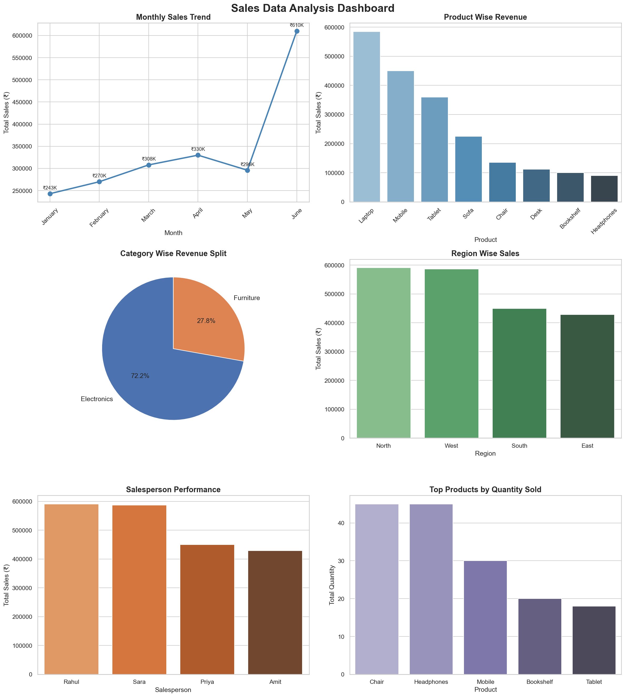

# 📊 Sales Data Analysis Project

A data analysis project built using Python, Pandas, Numpy, Matplotlib and Seaborn to analyze sales performance across products, regions, and salespersons.

---

## 🛠️ Tech Stack
- Python
- Pandas
- Numpy
- Matplotlib
- Seaborn

---

## 📁 Project Structure
```
sales_project/
├── sales_analysis.py    # Main analysis script
├── sales_data.csv       # Dataset (30 orders)
├── sales_dashboard.png  # Generated dashboard image
└── README.md            # Project documentation
```

---

## 📌 Features
- Loads and explores real sales data
- Cleans and processes date columns
- Analyzes revenue, quantity, and performance
- Generates a 6-chart dashboard including:
  - Monthly Sales Trend
  - Product Wise Revenue
  - Category Wise Revenue Split (Pie Chart)
  - Region Wise Sales
  - Salesperson Performance
  - Top Products by Quantity Sold
- Prints a complete Final Summary Report

---

## 📊 Dashboard Preview


---

## ▶️ How to Run

**1. Clone the repository**
```bash
git clone https://github.com/YOUR_USERNAME/sales-data-analysis.git
cd sales-data-analysis
```

**2. Install required libraries**
```bash
pip install pandas numpy matplotlib seaborn
```

**3. Run the project**
```bash
python sales_analysis.py
```

---

## 📈 Key Insights
- Analyzed 30 orders across 6 months (Jan–June 2024)
- Identified top performing product, region and salesperson
- Electronics category contributed highest revenue
- Monthly sales showed consistent growth trend

---

## 👤 Author
**Vibhansh Jain**  
B.Tech CSE — 2nd Year  
GitHub: [jainvibhansh72](https://github.com/jainvibhansh72)
